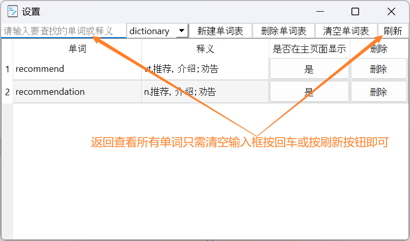
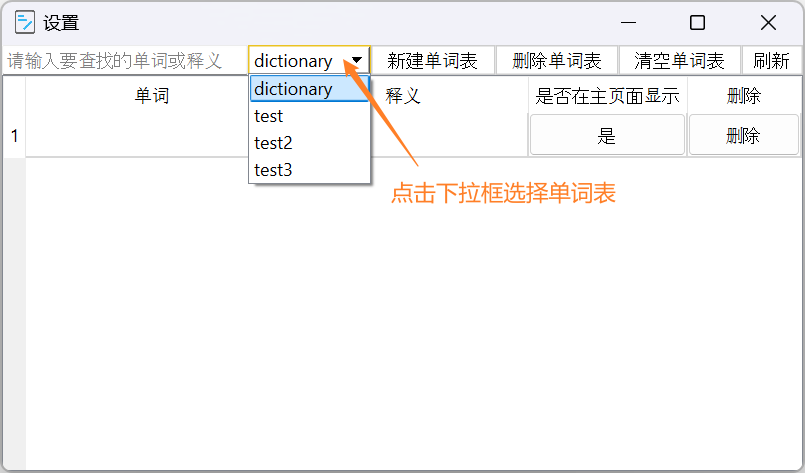
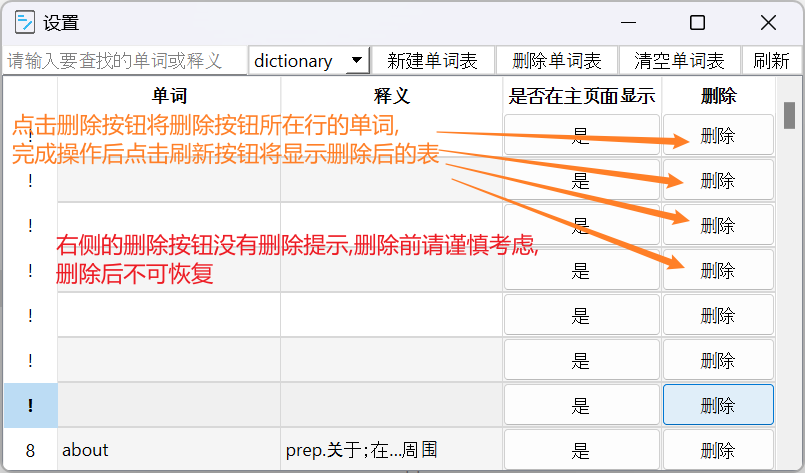

# hinter介绍 

hinter,一个单词本程序,适合用于浏览网站或软件时记录不认识的单词,方便以后学习或使用

默认有一张英语4级单词表,数据来源:[大学英语四级词汇手册_四级大纲词汇—中国教育在线](https://www.eol.cn/html/en/cetwords/cet4.shtml)通过python爬取的,本来是想爬4级和6级的单词,但在网上没找到合适的6级单词网站,就只爬了4级的单词

---

### 主要功能介绍

- 主页面
  - 输入框
  - 隐藏按钮
  - 暂停按钮
  - 显示释义按钮
  - 小数调整框
- 设置页面
  - 输入框
  - 单词表下拉框
  - 新建单词表按钮
  - 删除单词表按钮
  - 清空单词表按钮
  - 刷新按钮
  - 是否在主页面显示按钮
  - 删除按钮

---

### 主页面

- 默认从第一张表里抽取单词

- 点击设置按钮打开设置页面

- 点击隐藏按钮将把当前**显示单词的状态设为隐藏**,之后将不再主页面上显示,如需重新设置为显示状态,需在设置页面找到对应单词,点击**是否在主页面显示**列上的按钮

- 点击暂停按钮将暂停随机显示单词

---

###### 输入框

输入单词后按回车将显示查找的单词同时暂停随机显示单词,清空输入框后再按回车恢复随机显示单词

---

###### 显示释义按钮

点击按钮后将不再显示单词释义,再次点击恢复显示释义

---

###### 小数调整框

---

### 设置页面

默认显示第一张表

### 

---

###### 输入框

输入要查找的单词按回车将显示要查找的单词,支持模糊查找,**忘记单词里的某个或几个字母时可以用问号代替字母,一个问号代替一个字母**,中文或英文输入法模式下的问号都行

比如要找adequate这个单词,但不记得单词的后部分是什么字母,就可以用**ad???**或者**ad????**或者**ad?????**或者**ad??????**,都可以找到这个单词

忘记单词中间的字母组合也可以通过这样的方式查找,比如reading,只记得是re开头和ing结尾,就可以用**re??ing**来查找

或者想查找特定长度的单词,就可以依次累加问号

以及查找特定字母组合开头的单词

退出显示查找单词模式只需清空输入框按回车或点击刷新按钮即可

---

###### 单词表下拉框

当通过下拉框选择单词表后,主页面随机显示的单词表将从选择的单词表里抽取

---

###### 新建单词表

点击新建单词表后输入单词表名称后将创建一张新的表,创建单词表后**双击单元格**可以为单词表添加单词或释义,如不想添加释义可以只添加单词

**单词表名称可以有中文,平时创建单词表最好用中文命名,用英文命名的话**

    注意单词表的名称不能是以下单词:abort  action  add  after  all  alter  always  analyze  and  as  asc  attach  autoincrement  before  begin  between  by  cascade  case  cast  check  collate  column  commit  conflict  constraint  create  cross  current  current_date  current_time  current_timestamp   database  default  deferrable  deferred  delete  desc  detach  distinct  do  drop  each  else  end  escape  except  exclude  exclusive  exists  explain  fail  filter  first  following  for  foreign  from  full  generated  glob  group  groups  having  if  ignore  immediate  in  index  indexed  initially  inner  insert  instead  intersect  into  is  isnull  join  key  last  left  like  limit  match  materialized  natural no not nothing notnull null nulls of offset on or order  others  outer  over  partition  plan  pragma  preceding   primary  query  raise  range  recursive  references  regexp  reindex  release  rename  replace  restrict  returning  right  rollback  row  rows  savepoint  select  set  table  temp  temporary  then  ties  to  transaction  trigger  unbounded  union  unique  update  using  vacuum  values  view  virtual  when  where  window  with  without

这些单词为sqlite(这个程序所使用的数据库)中的保留字,使用这些单词作为表名可能会导致某些功能不能正常运行

这些单词中你可能会选作为表名的单词有:**table**,**defalut**,**first**,**group**,**groups**,**nothing**,**null**,**nulls**,**others**,**plan**,**primary**,**rename**,**replace**,**temp**,**temporary**

dictionary这张表不建议添加单词,这张表已经有4000+单词,往里添加单词可能会要久一点

---

###### 删除单词表

点击删除单词表按钮将删除在设置页面**正在显示的表**

---

###### 删除按钮

